## 📌 프로젝트 소개

### OP-AL

> **O**ld **P**eople with **A**ctive **L**ife  
> REST 거래 API를 활용한 쇼핑몰 프로젝트  
> 인생의 제 2막을 시작한 5060세대의 여가 및 건강 활동을 위한 공간을 소개·대여하는 공간 대여 플랫폼

### 프로젝트 기간

2023.05.30 - 2023.07.02

## 📌 배포 링크

### **[OP-AL](https://zippy-sable-b21ba3.netlify.app/)**

## 📌 개발 팀원 및 역할

### 패스트캠퍼스 프론트엔드 5기

|  |  |  |  | <a href="https://github.com/nangkong98"> |
| :------------------------------------------------------------------------------------------------------------------------------------: | :----------------------------------------------------------------------------------------------------------------------------------------------: | :------------------------------------------------------------------------------------------------------------------------------------: | :-------------------------------------------------------------------------------------------------------------------------------------: | :----------------------------------------------------------------------------------------------------------------------------------: |
|                                                 [주하림](https://github.com/wngkfla01)                                                 |                                                 [이시우](https://github.com/cuconveniencestore)                                                  |                                                 [이은지](https://github.com/dmswl2030)                                                 |                                                 [윤금엽](https://github.com/DevYBecca)                                                  |                                               [강동훈](https://github.com/nangkong98)                                                |
|                      GitHub 팀장  초기 개발 세팅  리덕스 설정  마이 페이지  (계좌, 구매내역)                       |                                            전체 디자인 스타일  제품 검색 기능  검색 리스트                                             |                                        로그인  회원가입  마이 페이지  (내 정보)                                         |                                              제품 상세 페이지  제품 결제 페이지                                               |                                                           더미데이터 수집                                                            |

## 📌 기술 스택

### Development

### Config

### Library

### Environment

### Deployment

### Cowork Tools

## 📌 구현 페이지 및 프리뷰

**1️⃣ 메인 페이지**

- 제품 검색, 이벤트 배너, 지금 뜨는 곳, 퀵메뉴(예약 정보 확인)

  

    
프리뷰

    
  

**2️⃣ 제품 페이지**

- 제품 리스트, 상세 페이지, 결제 페이지

  

    
프리뷰

    
  

**3️⃣ 마이 페이지**

- 내 정보 수정, 내 계좌 관리, 구매 내역 조회

  

    
프리뷰

    
  

**4️⃣ 인증**

- 로그인, 회원가입

  

    
프리뷰

    
  

## 📌 구현 화면

| 
메인 페이지 (로그인 전)
 | 
메인 페이지 (로그인 후)
                   |
| ----------------------------------------------------- | ----------------------------------------------------------------------- |
| 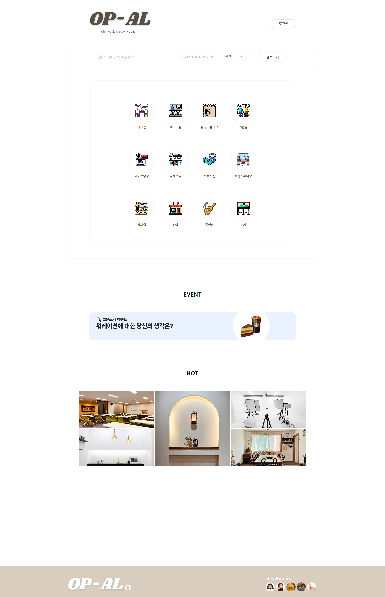       | 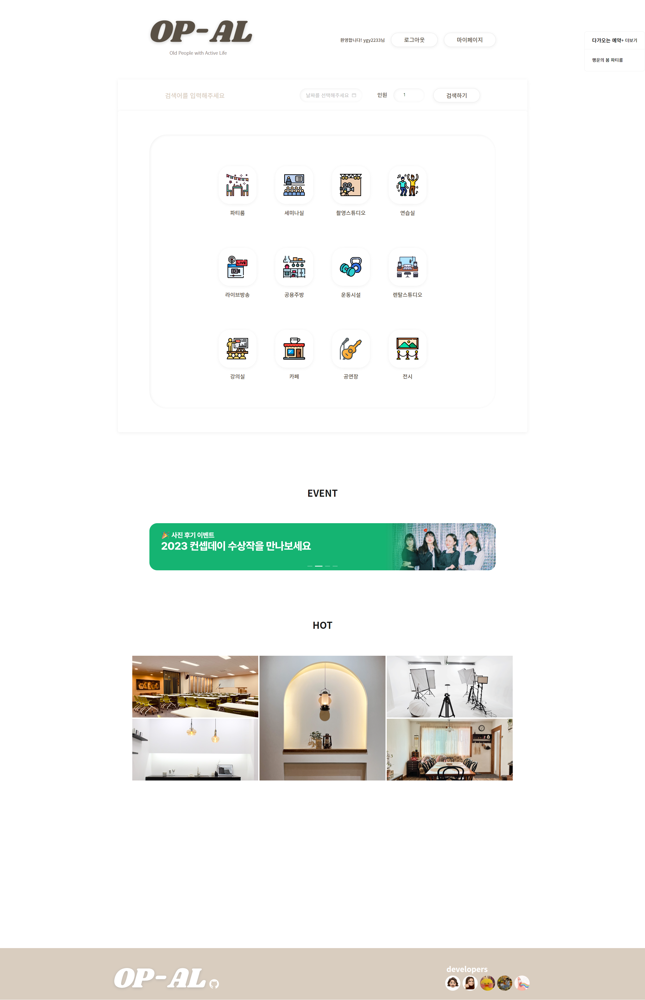 |

| 
로그인
                    | 
회원가입
                  |
| --------------------------------------------------- | --------------------------------------------------- |
| 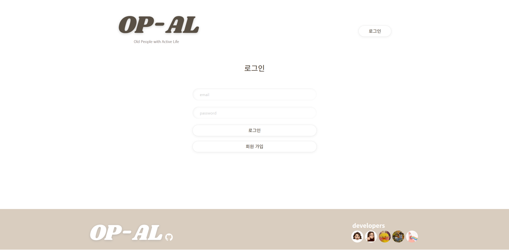 | 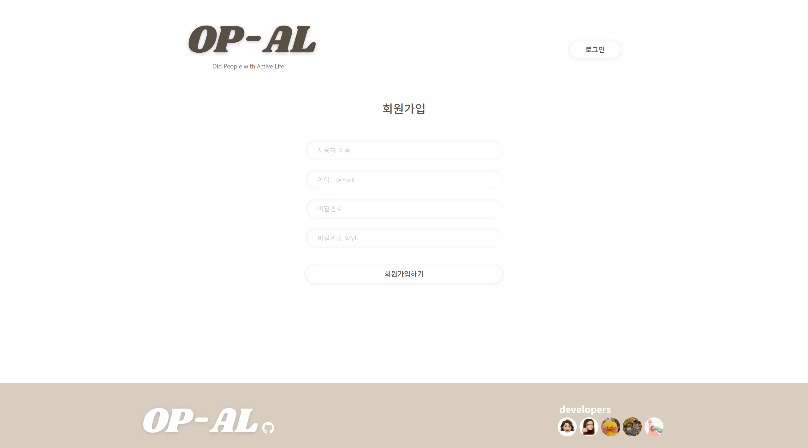 |

| 
메인 페이지 퀵메뉴 (로그인 후)
        | 
제품 검색 페이지
          |
| ------------------------------------------------------------------- | --------------------------------------------------- |
| 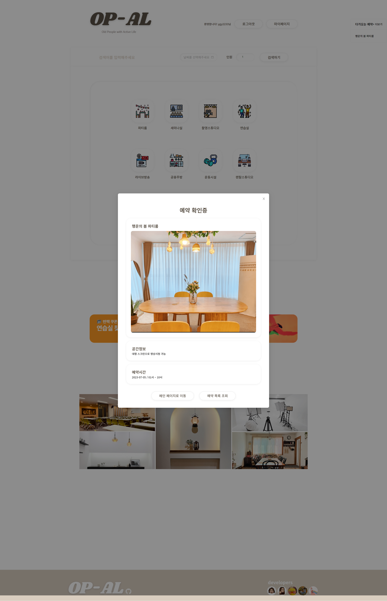 | 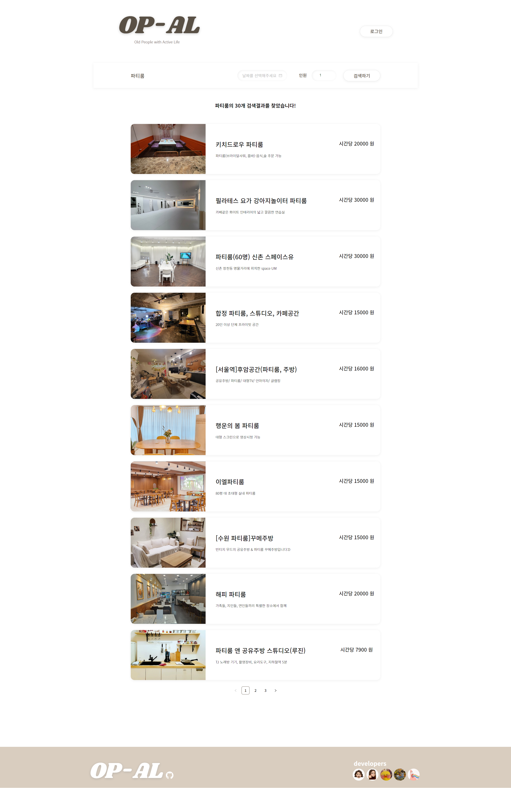 |

| 
제품 상세 페이지
                        | 
제품 결제 페이지
                          |
| ----------------------------------------------------------------- | ------------------------------------------------------------------- |
| 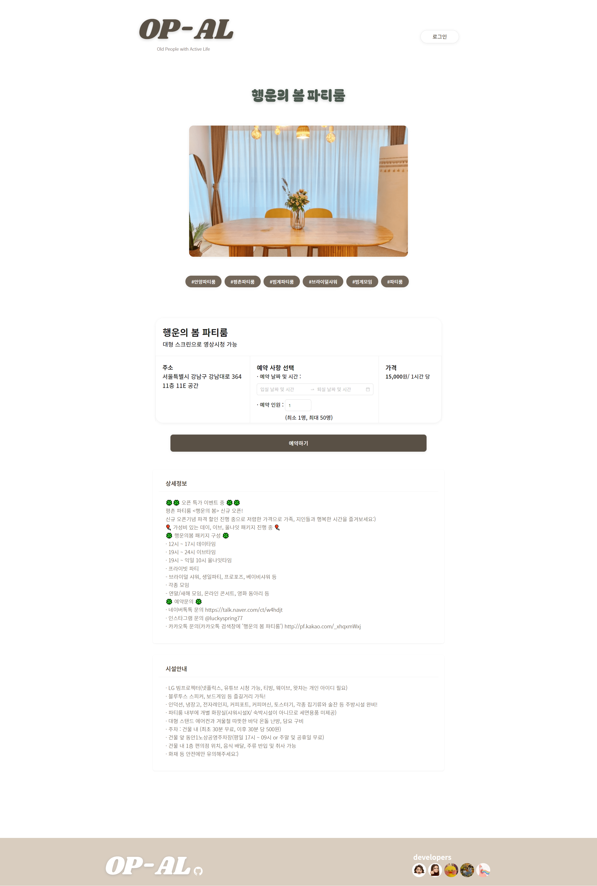 | 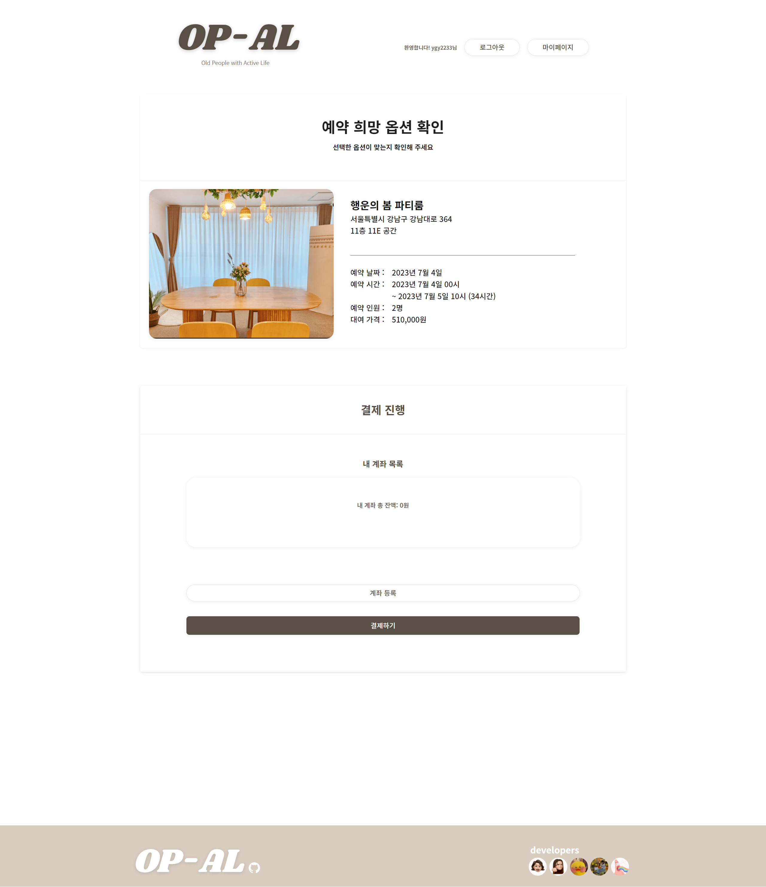 |

| 
마이 페이지 (내 정보)
           | 
마이 페이지 (내 계좌)
                 |
| ------------------------------------------------------------- | ------------------------------------------------------------------- |
| 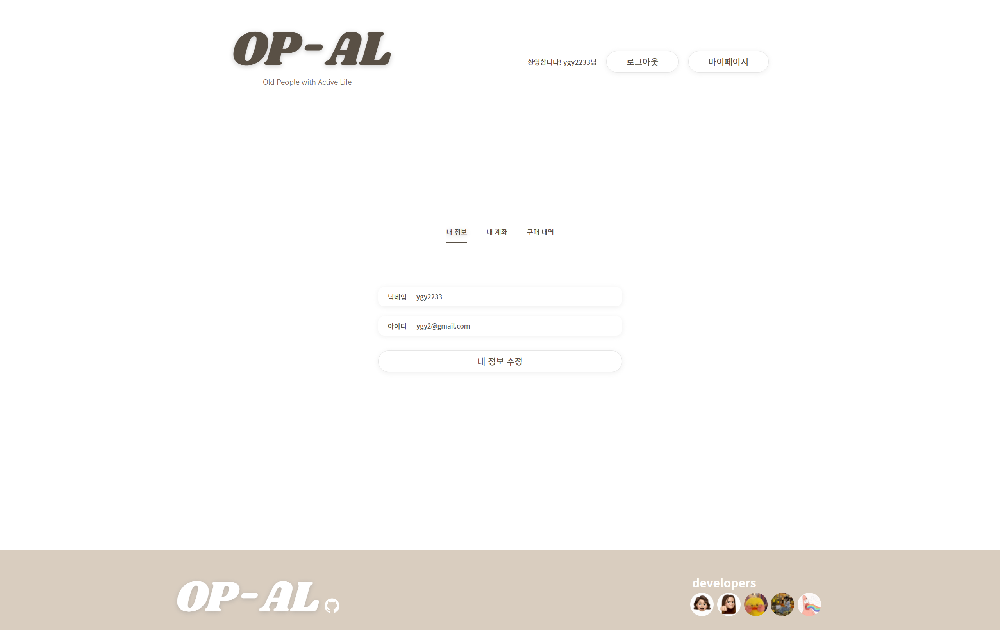 | 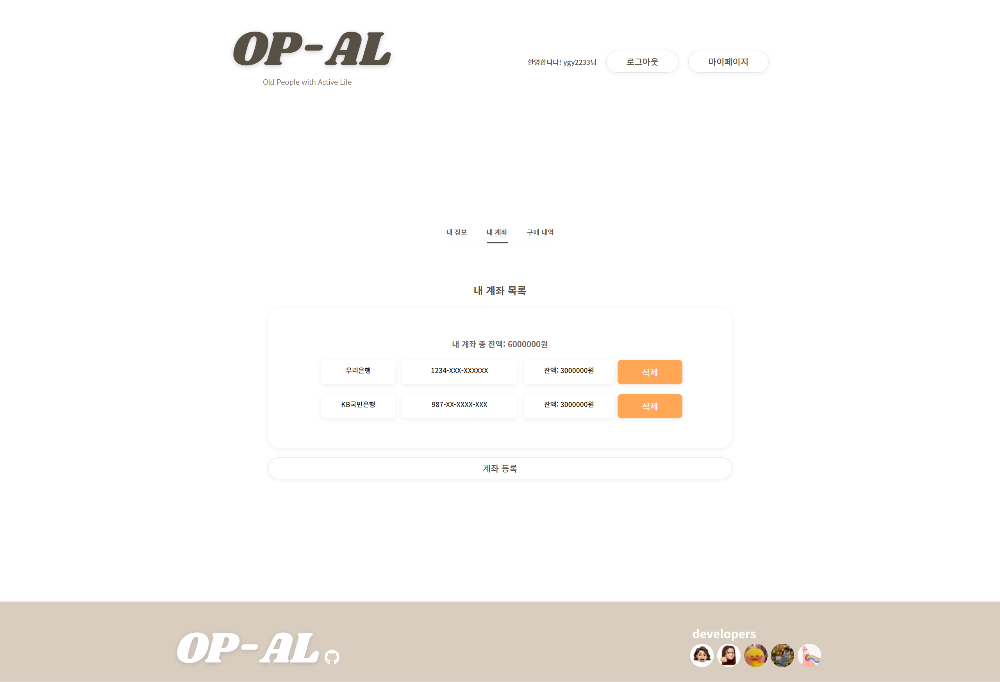 |

| 
마이 페이지 (구매 내역)
                 | 
마이 페이지 (구매 취소)
                     |
| --------------------------------------------------------------------- | ------------------------------------------------------------------------- |
| 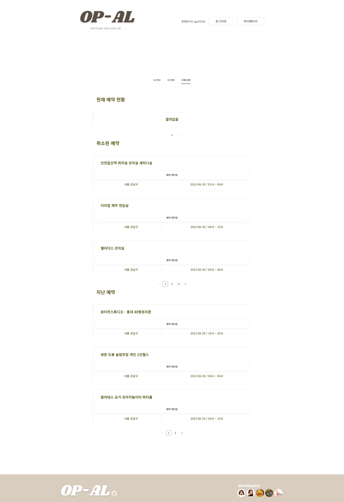 | 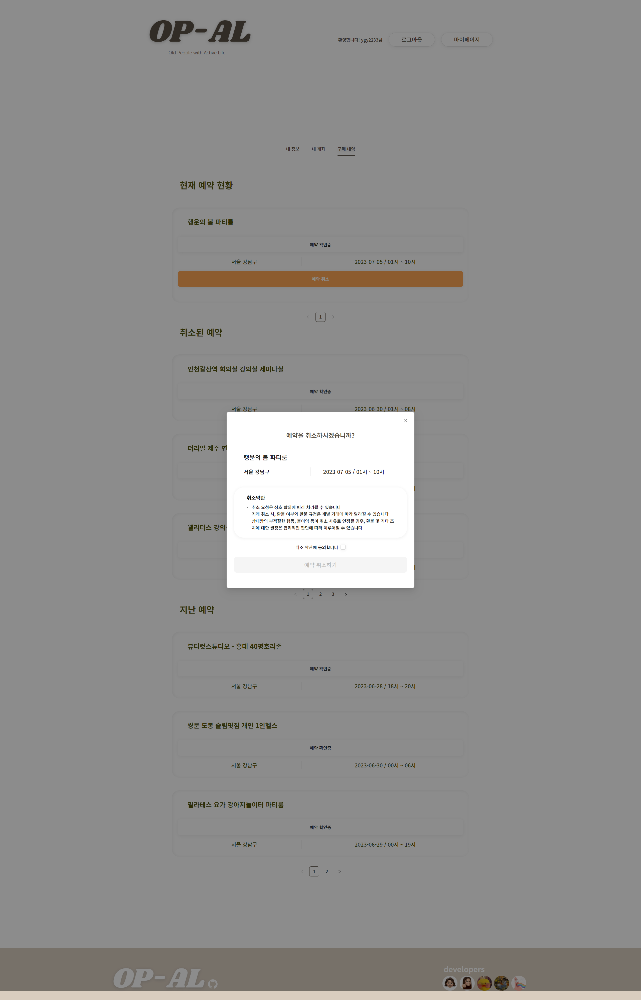 |

## 📌 담당 페이지 및 기능 구현

## 📌 프로젝트 회고
